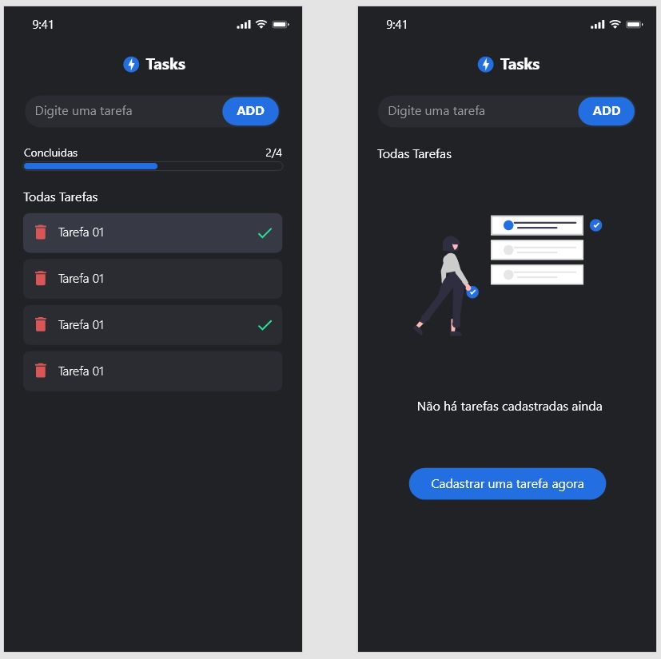

<h1 style='display: flex; gap: 10px'> 
   
  Tasks
</h1>

<h3><a href="https://tasks-bruno-zolini.vercel.app/" target="_blank">Link para o Deploy</a></h3>



## 💬 Contexto

<p>Este projeto foi um desafio proposto pelo <a href="https://github.com/raulpesilva" target="_blank">Raul Pereira</a>, com o objetivo de validar meus conhecimentos sobre componentização, hooks, estilização, lógica e utilização de contextos.</p>

## 👨🏼‍💻 Tecnologias Utilizadas:

* **React** 
* **ContextAPI** 
* **TypeScript** 
* **Styled-Components** 

## 🛠 Como Executar o Projeto

### Clonando o Repositório

```
git clone git@github.com:BrunoZolini/tasks.git
cd tasks
``` 

### Instalando Dependências
Com NPM:
```
npm install
``` 
Com Yarn:
```
yarn
``` 

### Executando aplicação
Com NPM:
```
npm run dev
``` 
Com Yarn:
```
yarn dev
``` 
